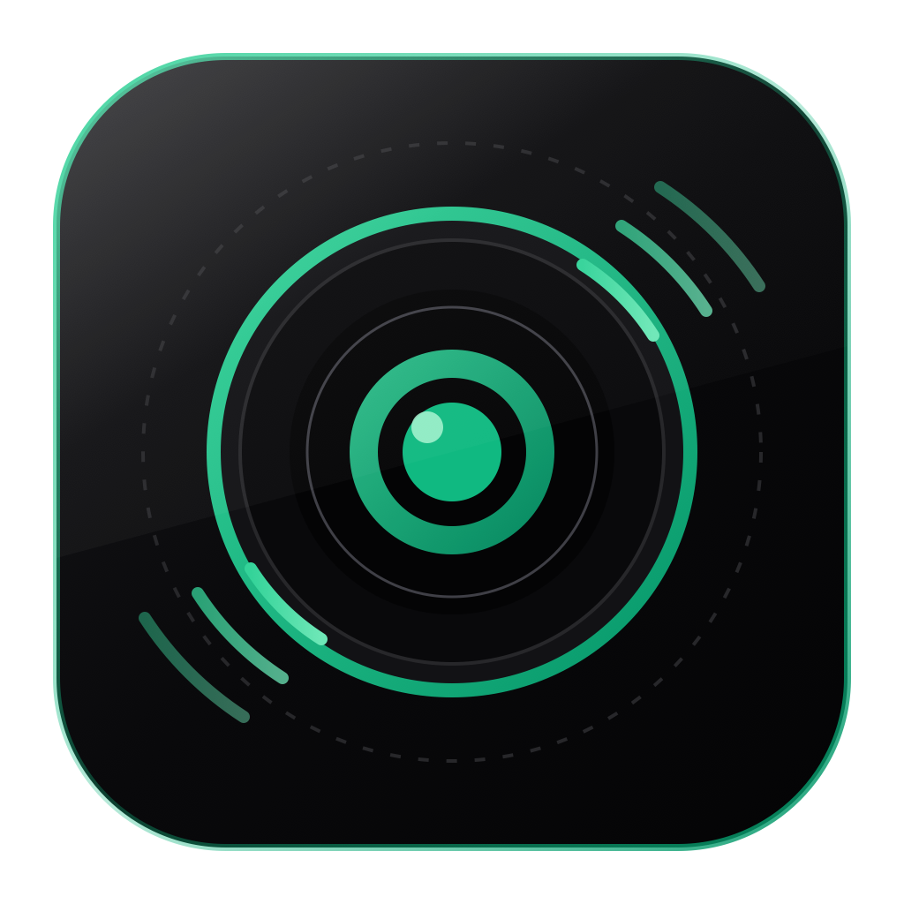

<div align="center">



# MacCam Bridge

### **Studio-Grade 1080p60 Ultra-Low Latency Webcam Suite for macOS & Windows**

[](https://github.com/somyacodes07/MacCamBridge/releases)
[](https://github.com/somyacodes07/MacCamBridge)
[](https://github.com/somyacodes07/MacCamBridge)
[](LICENSE)
[](https://developer.apple.com/swift/)
[](https://www.electronjs.org/)

<p align="center">
  <b>MacCam Bridge</b> transforms your MacBook camera into a high-definition, sub-5ms low-latency wireless & wired USB-C webcam for Windows 11 and macOS PCs.
</p>

[Download macOS DMG](https://github.com/somyacodes07/MacCamBridge/releases/latest) • [Download Windows Setup (.exe)](https://github.com/somyacodes07/MacCamBridge/releases/latest) • [Documentation](#-documentation)

---

</div>

## 🌟 Features & Highlights

- ⚡ **Sub-5ms Hardware Latency**: Zero-copy H.264 GPU encoding on macOS via **VideoToolbox (`VTCompressionSession`)** coupled with W3C **WebCodecs GPU decoding** on Windows.
- 🔌 **USB-C Direct Cable Mode**: 40 Gbps wired connection over a single USB-C to USB-C cable (`169.254.x.x`) for zero Wi-Fi interference and sub-5ms performance.
- 🎥 **System-Wide Virtual Webcam Driver**: Registers **`"MacCam Bridge Camera"`** natively for **Discord, OBS Studio, Zoom, Google Meet, Microsoft Teams, and WhatsApp**.
- 🎨 **Minimal Pitch-Dark Obsidian UI**: Premium monochrome black-and-white interface (Apple HIG compliant, 0 emojis, hidden scrollbars, system tray toolbar integration).
- 📡 **mDNS Bonjour Auto-Discovery**: Automatic network discovery (`_maccambridge._tcp`) with 1-click LAN scanning.
- 🔒 **100% Offline & Private**: Point-to-point local network streaming. No cloud servers, account logins, or telemetry.

---

## 🏗️ Architecture Breakdown

```text
┌─────────────────────────────────────────────────────────────────────────┐
│                          MacCam Bridge Sender                           │
└─────────────────────────────────────────────────────────────────────────┘
                                     │
       ┌─────────────────────────────┴─────────────────────────────┐
       ▼                                                           ▼
[Local Camera Preview]                                   [Video Capture Engine]
AVCaptureVideoPreviewLayer                             AVCaptureVideoDataOutput
(SwiftUI / NSViewRepresentable)                        (NV12 420v PixelBuffers)
                                                                   │
                                                                   ▼
                                                         [VideoFrameProcessor]
                                                       (Background Serial Queue)
                                                                   │
                                                                   ▼
                                                          [H264Encoder Engine]
                                                       VideoToolbox VTCompression
                                                       (1080p30 @ 8 Mbps Bitrate)
                                                                   │
                                                                   ▼
                                                       [FrameSinkMultiplexer]
                                                       ┌───────────┴───────────┐
                                                       ▼                       ▼
                                              [EncoderDebugSink]      [StreamServer]
                                               (Console Metrics)     (NWListener / WS)
                                                                               │
                                                                               ▼
                                                                 ┌───────────────────────────┐
                                                                 │  Wi-Fi / USB-C Direct     │
                                                                 │ Binary Protocol ("MCB1")  │
                                                                 └───────────────────────────┘
                                                                               │
       ┌───────────────────────────────────────────────────────────────────────┴───────────────────────────────────────────────────────────────────────┐
       ▼                                                                                                                                               ▼
┌─────────────────────────────────────────────────────────┐                                                   ┌─────────────────────────────────────────────────────────┐
│                 macOS Receiver Client                   │                                                   │                 Windows 11 Receiver App                 │
├─────────────────────────────────────────────────────────┤                                                   ├─────────────────────────────────────────────────────────┤
│ • StreamReceiver (NWConnection WebSocket)              │                                                   │ • Electron / WebCodecs GPU H.264 Decoder                │
│ • VideoToolbox Hardware Decoder (VTDecompressionSession)│                                                   │ • mcb_protocol_decoder.js (Annex-B Demuxer)             │
│ • Low-Latency AVSampleBufferDisplayLayer Renderer       │                                                   │ • Native Virtual Webcam Driver ("MacCam Bridge Camera") │
└─────────────────────────────────────────────────────────┘                                                   └─────────────────────────────────────────────────────────┘
```

---

## 🚀 Download & Installation

### 🍏 macOS Receiver & Sender
1. Download **[`MacCamBridge-macOS.dmg`](https://github.com/somyacodes07/MacCamBridge/releases/latest)** from Releases.
2. Open the `.dmg` image and drag **MacCam Bridge** into your `Applications` folder.
3. *First Time Opening*: Right-click `MacCamBridge.app` -> Select **Open** -> Click **Open** on the macOS security prompt.

### 🪟 Windows 11 / 10 Receiver
1. Download **[`MacCam-Bridge-Setup-Windows-x64-1.0.0.exe`](https://github.com/somyacodes07/MacCamBridge/releases/latest)** (Setup Wizard) or Portable EXE.
2. Run the installer executable to install MacCam Bridge with desktop shortcuts.
3. *Windows Defender Prompt*: Click **"More Info"** -> Click **"Run Anyway"**.

---

## 🔌 High-Speed USB-C Direct Cable Mode (Sub-5ms Latency)

MacCam Bridge supports direct **USB-C to USB-C cable connection** between your MacBook and Windows PC / Mac for zero-lag streaming:

1. **Plug USB-C Cable**: Connect a USB-C to USB-C cable directly between MacBook and PC.
2. **Auto-Link-Local IP**: macOS and Windows assign a high-speed Thunderbolt Bridge IP (`169.254.x.x`).
3. **Auto-Detection**: The Windows Receiver app highlights **`⚡ USB-C Cable Detected`** and populates the IP address automatically.

---

## 🎥 System-Wide Virtual Webcam Setup

To stream your MacBook camera into **Discord, OBS Studio, Zoom, Teams, or Google Meet**:

1. Click **"Enable Direct System Webcam"** in the Windows Receiver or macOS app.
2. Open your preferred video application (e.g. Discord or OBS).
3. Select **`"MacCam Bridge Camera"`** under Camera / Video Input settings.
4. *Driver Auto-Installer*: If Python dependencies are missing on Windows, click **"Auto-Install Driver"** when prompted.

---

## 📡 Binary Streaming Protocol (`MCB1`)

Network payloads are packed into binary frame packets using the following memory layout:

| Field | Type | Size | Description |
| :--- | :--- | :--- | :--- |
| **Magic** | `UInt32` (Big-Endian) | 4 Bytes | Protocol Identifier (`0x4D434231` / ASCII `"MCB1"`) |
| **Version** | `UInt8` | 1 Byte | Protocol Version (`1`) |
| **Packet Type** | `UInt8` | 1 Byte | `1` = Configuration (SPS/PPS), `2` = KeyFrame (IDR), `3` = DeltaFrame (P-Frame) |
| **Reserved** | `UInt16` | 2 Bytes | Alignment Padding (`0x0000`) |
| **Payload Length** | `UInt32` (Big-Endian) | 4 Bytes | Byte length of payload data |
| **PTS Value** | `Int64` (Big-Endian) | 8 Bytes | `CMTime.value` presentation timestamp |
| **PTS Timescale** | `Int32` (Big-Endian) | 4 Bytes | `CMTime.timescale` time unit definition |
| **Payload Data** | `Data` | N Bytes | Raw NAL Unit data or SPS/PPS configuration |

---

## 🛠️ Building From Source

### macOS Application
- **Requirements**: macOS 14.0+, Xcode 15.0+
- **Build Release DMG**:
  ```bash
  ./build_mac_dmg.sh
  ```

### Windows Receiver Application
- **Requirements**: Windows 10/11, Node.js 18+
- **Build Windows EXEs & Setup Installer**:
  ```bash
  cd WindowsReceiver
  npm install
  ./build_windows_exe.sh
  ```

---

## 📄 License
Licensed under the [MIT License](LICENSE). Built with ❤️ by [somyacodes07](https://github.com/somyacodes07).
